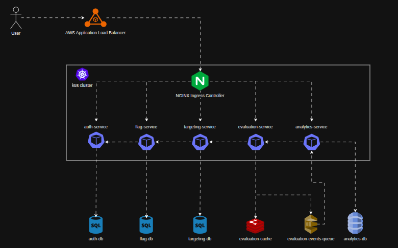

# ToggleMaster V2 - Entrega da Fase 2 (Microsserviços & EKS)

Este projeto evolui o monolito do ToggleMaster (da Fase 1) para uma arquitetura distribuída de 5 microsserviços rodando no Kubernetes (AWS EKS), com bancos de dados isolados e mensageria assíncrona.

---

## Informações da Entrega

* **Aluno:** Ricardo Marassato
* **RM:** 370358
* **Discord:** marassato7700
* **Repositório GitHub:** [https://github.com/RicardoMarassato/fiap-postech-tc2-togglemaster](https://github.com/RicardoMarassato/fiap-postech-tc2-togglemaster)
* **Link do Vídeo (Demonstração):** [https://drive.google.com/file/d/13AwpXtu6ki4e_tJXQc1rfbPe6VK2CNo9/view?usp=sharing](https://drive.google.com/file/d/13AwpXtu6ki4e_tJXQc1rfbPe6VK2CNo9/view?usp=sharing)

---

## Arquitetura de Microsserviços

O monolito foi quebrado em 5 serviços para isolar responsabilidades e evitar que processos pesados travem o caminho crítico de avaliação de flags:

* **auth-service (Go):** Validação de credenciais e chaves de API. Persiste no PostgreSQL (`auth_db`).
* **flag-service (Python):** CRUD de configuração das feature flags. Persiste no PostgreSQL (`flags_db`).
* **targeting-service (Python):** Gerenciamento das regras de segmentação de usuários. Persiste no PostgreSQL (`targeting_db`).
* **evaluation-service (Go):** Caminho crítico (hot path). Avalia as flags e retorna se o recurso está ativo (true/false) para o cliente. Para garantir latência mínima, usa Redis como cache e envia eventos de uso em background para o SQS (evitando travar o response da API).
* **analytics-service (Python):** Worker em background. Fica lendo a fila SQS e gravando os eventos no DynamoDB.

### Diagrama da Arquitetura

Abaixo está o diagrama representativo da arquitetura de microsserviços do ToggleMaster V2:



---

## Escolha dos Data Stores (RDS vs Redis vs DynamoDB)

Usei bases de dados com propósitos diferentes para otimizar a performance de cada microsserviço:

* **AWS RDS PostgreSQL (Bancos Relacionais):** Escolhido para `auth-service`, `flag-service` e `targeting-service` porque esses serviços tratam de dados estruturados (chaves de API, cadastros, regras) que mudam com pouca frequência e precisam de consistência forte (transações ACID). Cada microsserviço tem sua própria instância RDS independente para manter o isolamento de dados do domínio.
* **AWS ElastiCache Redis (Cache em Memória):** Usado pelo `evaluation-service`. Bater direto no Postgres a cada requisição de feature flag ia criar um gargalo no banco. Com o Redis, cacheio a decisão por 30 segundos (TTL). Consultas repetidas retornam na casa dos milissegundos.
* **AWS DynamoDB (NoSQL Chave-Valor):** Usado pelo `analytics-service` para logs e auditoria. Como são dados de telemetria gerados a cada requisição e gravados em lote, o DynamoDB permite escrita em massa escalável e rápida, sem concorrência ou custos altos de conexões abertas comuns em bancos SQL tradicionais.

---

## Como Executar o Projeto

### Rodando Local (Docker Compose)

O ambiente local sobe todos os serviços e bancos de forma integrada. 

*Nota sobre os bancos locais:* O PDF da Fase 2 sugeria 4 bancos locais (2 Postgres, 1 Redis, 1 DynamoDB Local). No entanto, para garantir que o ambiente de desenvolvimento local simulasse exatamente a produção na nuvem (que usa 3 instâncias independentes de RDS), optei por subir **3 instâncias PostgreSQL separadas** (portas `5433`, `5434` e `5435`). Assim, garanto o isolamento real dos dados em localdev.

Para iniciar, execute na raiz do projeto:
```bash
docker compose up -d --build
```

Para checar os containers ativos:
```bash
docker compose ps
```

### 💡 Dica de Produtividade: Clonando os Repositórios da Organização

Se você precisar clonar localmente todos os 5 repositórios originais dos microsserviços do projeto para desenvolvimento ou auditoria, pode utilizar o script auxiliar [git-cloner.py](git-cloner.py) presente na raiz deste repositório.

**Pré-requisitos:**
* Python 3.x
* GitHub CLI (`gh`) instalado e autenticado.

**Como rodar:**
```bash
python git-cloner.py
```
O script usará a GitHub CLI para clonar automaticamente: `auth-service`, `flag-service`, `targeting-service`, `evaluation-service` e `analytics-service`.

---

### Rodando na AWS (EKS)

Os manifestos do Kubernetes estão organizados em cada serviço, e o Ingress está na raiz.

#### Configuração do Cluster EKS:
* **AWS Academy (Opção A):** Criei o cluster e o Managed Node Group via console AWS usando a role padrão `LabRole`. A escalabilidade automática do node group foi configurada com Mínimo=1, Desejado=2 e Máximo=4.
* **Metrics Server:** Instalei usando o manifesto oficial do kubernetes-sigs para coletar as métricas necessárias para o HPA funcionar.
* **Nginx Ingress Controller:** Instalado via Helm. Como os nós rodam com a `LabRole`, ela tem permissão de provisionar automaticamente o Load Balancer (ALB/NLB) da AWS para gerenciar as rotas públicas.

#### Deploy dos Manifestos:
```bash
# 1. Cria o namespace
kubectl create namespace togglemaster

# 2. Aplica as configurações e deployments dos serviços
kubectl apply -f auth-service/auth-service-k8s-deployment.yaml
kubectl apply -f flag-service/flag-service-k8s-deployment.yaml
kubectl apply -f targeting-service/targeting-service-k8s-deployment.yaml
kubectl apply -f evaluation-service/evaluation-service-k8s-deployment.yaml
kubectl apply -f analytics-service/analytics-service-k8s-deployment.yaml
kubectl apply -f ingress.yml
```

Para verificar o status das criações:
```bash
kubectl get all -n togglemaster
kubectl get ingress -n togglemaster
```

---

## Estratégia de Escalabilidade e HPAs

### HPA por CPU (Configurado na AWS Academy)
Configurei HPAs para o `evaluation-service` e o `analytics-service` baseados na utilização de CPU (mínimo de 2 réplicas, máximo de 5, com alvo de 70% de consumo médio).

* **Workaround do analytics-service:** Como o ambiente AWS Academy bloqueia a criação de novas roles de IAM, não consegui configurar o IRSA (IAM Roles for Service Accounts) para o KEDA se autenticar no SQS e ler o tamanho da fila.
* **Como contornei isso:** Mantive o HPA tradicional baseado em CPU para o `analytics-service`. Sob carga pesada, a fila SQS acumula mensagens, o worker consome as mensagens em loops intensos de processamento, a CPU do container sobe acima de 70% e o Kubernetes escala novas réplicas de pods para dividir o consumo da fila.

### Recomendação em Produção com KEDA (Opção B)
Em uma conta pessoal (sem bloqueios de IAM), a boa prática seria usar o **KEDA** (Kubernetes Event-driven Autoscaling) configurando um `ScaledObject` monitorando a fila do SQS (`queueDepth`).
* **Vantagem:** A escala responde diretamente ao número de mensagens na fila de forma reativa. Além disso, permite **escalar para 0 réplicas** quando a fila estiver vazia, cortando custos com infraestrutura ociosa.

---

## Como Testar a Escalabilidade

1. Em um terminal fixo, fique monitorando o status dos HPAs e Pods:
   ```bash
   watch -n 1 "kubectl get hpa,pods -n togglemaster"
   ```
2. Em outro terminal, rode um teste de carga leve usando `ab` (ApacheBench) ou `hey` apontando para a URL pública do Load Balancer (Ingress) na rota de health check:
   ```bash
   ab -n 1000 -c 10 http://<URL_DO_LOAD_BALANCER>/evaluation/health
   ```
3. A utilização de CPU subirá no HPA e novas réplicas do pod começarão a ser criadas automaticamente.

---

## Desafios Enfrentados e Soluções

Durante a implantação e testes do ecossistema de microsserviços, surgiram alguns problemas comuns de Kubernetes e infraestrutura que precisei resolver:

### 1. Erro 404 nas rotas do Ingress (Rewrite Target)
* **Desafio:** Ao tentar bater na URL do Ingress (ex: `http://<LB_URL>/auth/health`), o Ingress Controller repassava a rota completa para o serviço. Como a aplicação respondia apenas a partir da raiz (`/health`), a API retornava 404.
* **Solução:** Adicionei anotações de rewrite target no `ingress.yml` (`nginx.ingress.kubernetes.io/rewrite-target: /$2`) configurando caminhos baseados em regex (ex: `path: /auth(/|$)(.*)`). Dessa forma, o Ingress limpa o prefixo do path antes de entregar a requisição pro container.

### 2. Tabela api_keys não encontrada no RDS Postgres
* **Desafio:** O pod do `auth-service` subia sem erros, mas ao tentar gerar chaves dava erro de banco porque a tabela `api_keys` não existia no RDS recém-criado na AWS (o script SQL de criação só rodava localmente).
* **Solução:** Conectei ao banco RDS de forma manual via terminal utilizando `psql` e executei o script `auth-service/db/init.sql` para criar o schema inicial. Em uma esteira de CI/CD real, a solução seria automatizar isso na inicialização do serviço com um Kubernetes `Job` ou ferramentas de migração de banco (como Flyway ou Golang Migrate) rodando antes do app iniciar.

### 3. Falha de Startup da Aplicação (CrashLoopBackOff)
* **Desafio:** Algumas vezes, no startup do cluster, os pods das aplicações tentavam se conectar aos bancos de dados RDS antes de as instâncias terminarem de iniciar na nuvem, quebrando o processo do container.
* **Solução:** Configurei as probes do Kubernetes (`readinessProbe` e `livenessProbe`) com `initialDelaySeconds` apropriados para dar tempo dos bancos iniciarem e testarem a conexão antes do Kubernetes classificar os containers como prontos e abertos para receber tráfego.

### 4. Tamanho das Imagens Docker
* **Desafio:** As primeiras imagens Docker dos microsserviços em Go ficaram gigantes (mais de 400MB), o que tornava o deploy e o envio (push) para o ECR muito demorado.
* **Solução:** Reescrevi as Dockerfiles usando **Multi-stage Builds**. O primeiro estágio compila a aplicação com a imagem completa do Golang e o estágio final copia o executável gerado para uma imagem limpa e leve do `alpine`. A imagem caiu para menos de 50MB.

---

## Próximos Passos (Melhorias Futuras)

Para evoluir este ecossistema para um ambiente produtivo pronto para o mercado, mapeei as seguintes melhorias:

* **Migração para KEDA:** Mudar a escala do processador de analytics para rodar por tamanho de fila (e com escala até zero pods), resolvendo a dependência de CPU.
* **Observabilidade Centralizada:** Integrar o AWS X-Ray para habilitar o tracing distribuído (permitindo ver a latência exata da comunicação leste-oeste entre microsserviços) e configurar dashboards consolidados de infraestrutura no CloudWatch.
* **Automação de CI/CD:** Criar pipelines completos no GitHub Actions para rodar testes, buildar as imagens, publicar no AWS ECR e aplicar os manifestos no Kubernetes automaticamente a cada alteração.
* **Agregação de Logs:** Implementar agentes de log nos nós do Kubernetes (como Fluentd ou AWS CloudWatch Agent) para centralizar e indexar os logs dos containers.
* **Uso de Spot Instances:** Configurar o uso de instâncias Spot para workloads não-críticos e workers assíncronos (como o `analytics-service`), otimizando consideravelmente o custo de infraestrutura na AWS.

---

